# Mermaid.js Web Integration Skill

This skill documents best practices for integrating Mermaid.js diagrams into web applications, based on official Mermaid.js documentation and real-world implementation experience.

## Key Learnings

### 1. Font Loading Issue - "Labels Out of Bounds"

**Problem:** Text labels get cut off or appear outside diagram boundaries.

**Root Cause:** Mermaid renders before web fonts are fully loaded, causing incorrect text measurements.

**Solution:** Use `window.onload` instead of `DOMContentLoaded`:

```javascript
// ❌ WRONG - fonts may not be loaded yet
document.addEventListener('DOMContentLoaded', async function () {
    await mermaid.run();
});

// ✅ CORRECT - waits for all assets including fonts
window.addEventListener('load', async function () {
    await mermaid.run();
});
```

**Source:** [Mermaid.js Usage Docs](https://mermaid.js.org/config/usage.html#labels-out-of-bounds)

---

### 2. Text Cutoff - useMaxWidth Setting

**Problem:** Diagram content is truncated or text is cut off.

**Solution:** Set `useMaxWidth: false` in flowchart configuration:

```javascript
mermaid.initialize({
    flowchart: {
        useMaxWidth: false  // CRITICAL: allows natural sizing
    }
});
```

When `useMaxWidth: true` (default), diagrams are constrained to container width, which can cause text truncation. Setting it to `false` allows the diagram to size naturally.

---

### 3. Rendering Diagrams in Hidden Tabs

**Problem:** Mermaid cannot calculate dimensions for elements with `display: none`.

**Solution:** Temporarily show all tabs during rendering:

```javascript
window.addEventListener('load', async function () {
    const panels = document.querySelectorAll('.diagram-panel');
    
    // 1. Temporarily show all panels (position off-screen to avoid flash)
    panels.forEach(panel => {
        panel.style.visibility = 'hidden';
        panel.style.display = 'block';
        panel.style.position = 'absolute';
        panel.style.left = '-9999px';
    });

    // 2. Render all diagrams
    await mermaid.run();

    // 3. Restore tabbed state
    panels.forEach(panel => {
        panel.style.visibility = '';
        panel.style.position = '';
        panel.style.left = '';
        if (!panel.classList.contains('active')) {
            panel.style.display = 'none';
        }
    });
});
```

---

### 4. Theme Configuration

**Available Themes:**
- `default` - Standard theme (matches Mermaid Playground)
- `neutral` - Black and white, good for printing
- `dark` - Dark mode
- `forest` - Shades of green
- `base` - Only theme that can be customized with themeVariables

**Best Practice:** Use `default` theme for consistency with Mermaid Playground:

```javascript
mermaid.initialize({
    theme: 'default'
});
```

**Custom Themes:** Only `base` theme supports `themeVariables`:

```javascript
mermaid.initialize({
    theme: 'base',
    themeVariables: {
        primaryColor: '#ffffff',
        primaryBorderColor: '#3b82f6'
        // Note: Must use hex colors, not color names
    }
});
```

---

### 5. CSS for Mermaid Containers

```css
/* Container styling */
.mermaid-container {
    overflow-x: auto;        /* Allow horizontal scroll */
    overflow-y: visible;     /* Don't clip vertically */
    min-height: 400px;
}

/* SVG should not be constrained */
.mermaid-container svg {
    max-width: 100%;
    height: auto;
    overflow: visible;       /* Prevent text clipping */
}

/* Ensure SVG text elements are not clipped */
.mermaid-container svg text {
    overflow: visible;
}

/* Font specification (prevents font loading issues) */
pre.mermaid {
    font-family: 'trebuchet ms', verdana, arial, sans-serif;
    background: transparent;
    border: none;
}
```

---

### 6. Diagram Syntax Best Practices

**Subgraph with Emoji and Styling:**

```mermaid
flowchart LR
    subgraph Group["📊 Group Title"]
        A[Node A]
        B[Node B]
    end
    
    style Group fill:#e1f5fe,stroke:#01579b
```


**Database/Cylinder Nodes:**


**Decision Diamonds:**


**Multi-line Labels (use `<br/>`):**


---

### 7. Initialization Configuration

```javascript
mermaid.initialize({
    startOnLoad: false,      // Manual rendering for complex setups
    theme: 'default',
    securityLevel: 'loose',  // Required for click events and HTML
    flowchart: {
        curve: 'basis',      // Smooth curved lines
        padding: 15,
        nodeSpacing: 50,
        rankSpacing: 70,
        htmlLabels: true,    // Allow HTML in labels
        useMaxWidth: false   // Natural sizing
    }
});
```

---

### 8. Manual Rendering

For complex scenarios (tabs, dynamic content):

```javascript
// Render all .mermaid elements
await mermaid.run();

// Render specific elements
await mermaid.run({
    nodes: [document.getElementById('myDiagram')]
});

// Render with custom selector
await mermaid.run({
    querySelector: '.my-diagrams'
});
```

---

## Troubleshooting Checklist

| Issue | Solution |
|-------|----------|
| Text cut off | Set `useMaxWidth: false` |
| Labels out of bounds | Use `window.onload` instead of `DOMContentLoaded` |
| Hidden tabs not rendering | Show tabs temporarily during `mermaid.run()` |
| Theme not matching | Use `theme: 'default'` globally |
| Custom theme not working | Only `base` theme supports `themeVariables` |
| Diagram not appearing | Check browser console for Mermaid errors |
| Styling not applied | Use `style` or `classDef` in diagram code |

---

## References

- [Mermaid.js Official Docs](https://mermaid.js.org/)
- [Theme Configuration](https://mermaid.js.org/config/theming.html)
- [Usage Guide](https://mermaid.js.org/config/usage.html)
- [Flowchart Syntax](https://mermaid.js.org/syntax/flowchart.html)
- [Mermaid Live Editor](https://mermaid.live/)
