# AIMS Data Platform - Architecture Diagrams

> **Generated:** 19 January 2026 | **Version:** 1.4.0

## 1. Complete System Architecture

```mermaid
flowchart TB
    subgraph ENTRY["🚀 Entry Points"]
        ORCH["00_AIMS_Orchestration.ipynb"]
        SCRIPT["scripts/run_pipeline.py"]
    end

    subgraph CONFIG["⚙️ Configuration Layer"]
        direction LR
        YAML["notebook_settings.yaml"]
        SETTINGS["Settings Class"]
        ENV["Environment Detection"]
        
        YAML --> SETTINGS
        ENV --> SETTINGS
    end

    subgraph PLATFORM["🖥️ Platform Detection"]
        direction TB
        IS_FABRIC{"/lakehouse/default/Files exists?"}
        LOCAL["🐧 Local Linux"]
        FABRIC["☁️ MS Fabric"]
        
        IS_FABRIC -->|No| LOCAL
        IS_FABRIC -->|Yes| FABRIC
    end

    subgraph LIBS["📚 Library Architecture"]
        direction TB
        AIMS["aims_data_platform<br/>v1.4.0"]
        DQ["dq_framework<br/>v1.2.0"]
        GE["Great Expectations<br/>v0.18.x"]
        
        AIMS -->|imports| DQ
        DQ -->|uses| GE
    end

    subgraph PIPELINE["🔄 Pipeline Phases"]
        direction LR
        P1["Phase 1<br/>PROFILING"]
        P2["Phase 2<br/>VALIDATION"]
        P3["Phase 3<br/>MONITORING"]
        
        P1 --> P2 --> P3
    end

    subgraph DATA["💾 Data Layers (Medallion)"]
        direction LR
        BRONZE[("🥉 Bronze<br/>68 Parquet Files")]
        SILVER[("🥈 Silver<br/>Validated Data")]
        GOLD[("🥇 Gold<br/>Analytics Ready")]
        
        BRONZE --> SILVER --> GOLD
    end

    ENTRY --> CONFIG
    CONFIG --> PLATFORM
    PLATFORM --> LIBS
    LIBS --> PIPELINE
    PIPELINE --> DATA

    style ENTRY fill:#e1f5fe
    style CONFIG fill:#fff3e0
    style PLATFORM fill:#f3e5f5
    style LIBS fill:#e8f5e9
    style PIPELINE fill:#fce4ec
    style DATA fill:#fffde7
```

---

## 2. Detailed Pipeline Flow

```mermaid
flowchart TD
    subgraph INIT["🔧 Initialization"]
        START([Start Pipeline])
        LOAD_SETTINGS["Load Settings<br/>from YAML"]
        DETECT_ENV["Detect Environment<br/>IS_FABRIC check"]
        SET_PATHS["Configure Paths<br/>base_dir, bronze_dir, etc."]
        
        START --> LOAD_SETTINGS --> DETECT_ENV --> SET_PATHS
    end

    subgraph PHASE1["📊 Phase 1: Data Profiling"]
        CHECK_P1{"Profiling<br/>Enabled?"}
        BATCH_PROFILER["BatchProfiler<br/>run_parallel_profiling()"]
        DATA_PROFILER["DataProfiler<br/>profile() + generate_expectations()"]
        GEN_CONFIGS["Generate 68<br/>Validation YAMLs"]
        
        CHECK_P1 -->|Yes| BATCH_PROFILER
        CHECK_P1 -->|No| SKIP_P1([Skip])
        BATCH_PROFILER --> DATA_PROFILER --> GEN_CONFIGS
    end

    subgraph PHASE2["✅ Phase 2: Validation & Ingestion"]
        CHECK_P2{"Ingestion<br/>Enabled?"}
        LOAD_CONFIG["ConfigLoader<br/>load() validation YAML"]
        LOAD_DATA["DataLoader<br/>load_data() from Bronze"]
        DQ_VALIDATOR["DataQualityValidator<br/>validate()"]
        CHECK_PASS{"Pass Rate<br/>≥ Threshold?"}
        WRITE_SILVER["StorageManager<br/>write_to_silver()"]
        QUARANTINE["Write to<br/>Quarantine"]
        
        CHECK_P2 -->|Yes| LOAD_CONFIG
        CHECK_P2 -->|No| SKIP_P2([Skip])
        LOAD_CONFIG --> LOAD_DATA --> DQ_VALIDATOR --> CHECK_PASS
        CHECK_PASS -->|Yes| WRITE_SILVER
        CHECK_PASS -->|No| QUARANTINE
    end

    subgraph PHASE3["📈 Phase 3: Monitoring"]
        CHECK_P3{"Monitoring<br/>Enabled?"}
        GEN_REPORTS["Generate DQ<br/>Reports"]
        DQ_MATRIX["Build DQ<br/>Matrix Dashboard"]
        ALERTS["Send Alerts<br/>(if configured)"]
        
        CHECK_P3 -->|Yes| GEN_REPORTS
        CHECK_P3 -->|No| SKIP_P3([Skip])
        GEN_REPORTS --> DQ_MATRIX --> ALERTS
    end

    FINISH([Pipeline Complete])

    INIT --> PHASE1
    PHASE1 --> PHASE2
    PHASE2 --> PHASE3
    PHASE3 --> FINISH

    style INIT fill:#e3f2fd
    style PHASE1 fill:#fff8e1
    style PHASE2 fill:#e8f5e9
    style PHASE3 fill:#fce4ec
```

---

## 3. Library Dependencies & Class Hierarchy

---

## 4. Dual Platform Architecture

```mermaid
flowchart LR
    subgraph DETECTION["Platform Detection"]
        CHECK{{"Path('/lakehouse/default/Files').exists()"}}
    end

    subgraph LOCAL["🐧 Local Linux Environment"]
        direction TB
        L_BASE["base_dir: project root"]
        L_STORAGE["Storage: Parquet"]
        L_WORKERS["Workers: 4"]
        L_OPS["File Ops: shutil"]
        L_PATHS["Paths:<br/>data/Samples_LH_Bronze_Aims_26_parquet/<br/>data/Silver/<br/>data/Gold/"]
    end

    subgraph FABRIC["☁️ MS Fabric Environment"]
        direction TB
        F_BASE["base_dir: /lakehouse/default/Files"]
        F_STORAGE["Storage: Delta Lake"]
        F_WORKERS["Workers: 8-16"]
        F_OPS["File Ops: mssparkutils.fs"]
        F_PATHS["Paths:<br/>/lakehouse/default/Files/Bronze/<br/>/lakehouse/default/Files/Silver/<br/>/lakehouse/default/Files/Gold/"]
    end

    CHECK -->|False| LOCAL
    CHECK -->|True| FABRIC

    style LOCAL fill:#e8f5e9
    style FABRIC fill:#e3f2fd
    style DETECTION fill:#fff3e0
```

---

## 5. Data Quality Validation Flow

```mermaid
flowchart TD
    subgraph INPUT["📥 Input"]
        PARQUET[("Bronze Parquet<br/>aims_*.parquet")]
        YAML_CONFIG["Validation Config<br/>aims_*_validation.yml"]
    end

    subgraph LOADING["📂 Loading"]
        LOAD_DF["DataLoader.load_data()<br/>→ pandas DataFrame"]
        LOAD_CFG["ConfigLoader.load()<br/>→ expectations dict"]
    end

    subgraph VALIDATION["✅ Great Expectations Validation"]
        CREATE_CTX["Create Ephemeral<br/>GE Context"]
        CREATE_SUITE["Create Expectation Suite<br/>add_or_update_expectation_suite()"]
        ADD_EXPECT["Add Expectations<br/>(23-70 per table)"]
        CREATE_DS["Create Pandas<br/>Datasource"]
        RUN_CHECK["Run Checkpoint<br/>checkpoint.run()"]
    end

    subgraph RESULTS["📊 Results Processing"]
        GET_STATS["Extract Statistics<br/>evaluated, successful, failed"]
        CALC_SEVERITY["Calculate per-Severity<br/>Pass Rates"]
        CHECK_THRESH{"Pass Rate ≥<br/>Threshold?"}
        SUCCESS["✅ SUCCESS<br/>Write to Silver"]
        FAILURE["❌ FAILURE<br/>Quarantine + Alert"]
    end

    PARQUET --> LOAD_DF
    YAML_CONFIG --> LOAD_CFG
    LOAD_DF --> CREATE_CTX
    LOAD_CFG --> CREATE_SUITE
    CREATE_CTX --> CREATE_SUITE --> ADD_EXPECT --> CREATE_DS --> RUN_CHECK
    RUN_CHECK --> GET_STATS --> CALC_SEVERITY --> CHECK_THRESH
    CHECK_THRESH -->|Yes| SUCCESS
    CHECK_THRESH -->|No| FAILURE

    style INPUT fill:#fff8e1
    style LOADING fill:#e3f2fd
    style VALIDATION fill:#f3e5f5
    style RESULTS fill:#e8f5e9
```

---

## 6. Configuration Hierarchy

```mermaid
flowchart TD
    subgraph SOURCES["📁 Configuration Sources"]
        direction LR
        ENV_VARS["🔐 Environment Variables<br/>(highest priority)"]
        DOTENV[".env File"]
        YAML["notebook_settings.yaml"]
        DEFAULTS["Code Defaults<br/>(lowest priority)"]
    end

    subgraph YAML_STRUCTURE["📄 notebook_settings.yaml Structure"]
        direction TB
        ENVS["environments:<br/>  local: {...}<br/>  fabric_dev: {...}<br/>  fabric_prod: {...}"]
        DQ_CFG["data_quality:<br/>  threshold: 85.0<br/>  severity_levels: {...}"]
        PATHS_CFG["paths:<br/>  bronze: data/...<br/>  silver: data/Silver"]
        PIPELINE_CFG["pipeline:<br/>  phases:<br/>    profiling: true<br/>    validation: true"]
        STORAGE_CFG["storage:<br/>  format: parquet<br/>  compression: snappy"]
    end

    subgraph SETTINGS_CLASS["🎯 Settings Object (Immutable)"]
        S_ENV["environment: 'local'"]
        S_BASE["base_dir: Path"]
        S_BRONZE["bronze_dir: Path"]
        S_PHASES["pipeline_phases: Dict"]
        S_THRESH["dq_threshold: 85.0"]
    end

    ENV_VARS --> SETTINGS_CLASS
    DOTENV --> SETTINGS_CLASS
    YAML --> SETTINGS_CLASS
    DEFAULTS --> SETTINGS_CLASS

    YAML --> YAML_STRUCTURE

    style SOURCES fill:#fff3e0
    style YAML_STRUCTURE fill:#e8f5e9
    style SETTINGS_CLASS fill:#e3f2fd
```

---

## 7. File & Directory Structure

---

## 8. End-to-End Data Flow

```mermaid
sequenceDiagram
    autonumber
    participant User
    participant Orchestrator as 00_AIMS_Orchestration
    participant Settings
    participant BatchProfiler
    participant DQValidator as DataQualityValidator
    participant Storage as StorageManager
    participant Bronze as Bronze Layer
    participant Silver as Silver Layer

    User->>Orchestrator: Run Pipeline
    Orchestrator->>Settings: Settings.load()
    Settings-->>Orchestrator: settings object
    
    Note over Orchestrator: Phase 1: Profiling
    Orchestrator->>BatchProfiler: run_parallel_profiling()
    BatchProfiler->>Bronze: Read parquet files
    Bronze-->>BatchProfiler: DataFrames
    BatchProfiler-->>Orchestrator: 68 validation configs

    Note over Orchestrator: Phase 2: Validation
    loop For each table (68x)
        Orchestrator->>Bronze: Load parquet
        Bronze-->>Orchestrator: DataFrame
        Orchestrator->>DQValidator: validate(df, config)
        DQValidator->>DQValidator: Run GE expectations
        DQValidator-->>Orchestrator: {success, score, details}
        
        alt score >= threshold
            Orchestrator->>Storage: write_to_silver(df, table)
            Storage->>Silver: Write parquet/delta
        else score < threshold
            Orchestrator->>Storage: write_to_quarantine(df)
        end
    end

    Note over Orchestrator: Phase 3: Monitoring
    Orchestrator->>Orchestrator: Generate reports
    Orchestrator-->>User: Pipeline Complete ✅
```

---

## 9. Audit Summary Diagram

```mermaid
flowchart TB
    subgraph AUDIT["🔍 Audit Results - 19 Jan 2026"]
        direction TB
        
        subgraph FIXED["🔧 Issues Fixed"]
            FIX1["❌→✅ Missing pipeline_phases<br/>property in Settings"]
            FIX2["❌→✅ GE expectations not<br/>evaluating (0 checks)"]
        end

        subgraph VERIFIED["✅ Verified Working"]
            V1["Platform Detection"]
            V2["Settings Loading"]
            V3["68 Config/Data Alignment"]
            V4["DQ Validation (23 checks)"]
            V5["Import Chain"]
            V6["Conda Environment"]
        end

        subgraph METRICS["📊 Test Metrics"]
            M1["aims_activitydates<br/>23 checks | 100%"]
            M2["aims_assets<br/>70 checks | 92.9%"]
            M3["aims_people<br/>42 checks | 97.6%"]
        end
    end

    VERDICT{{"✅ PRODUCTION READY"}}
    
    FIXED --> VERDICT
    VERIFIED --> VERDICT
    METRICS --> VERDICT

    style AUDIT fill:#f5f5f5
    style FIXED fill:#ffebee
    style VERIFIED fill:#e8f5e9
    style METRICS fill:#e3f2fd
    style VERDICT fill:#c8e6c9,stroke:#2e7d32,stroke-width:3px
```

---

## Usage

View these diagrams in:
- **VS Code:** Install "Markdown Preview Mermaid Support" extension
- **GitHub:** Native rendering in markdown files
- **Mermaid Live Editor:** https://mermaid.live

