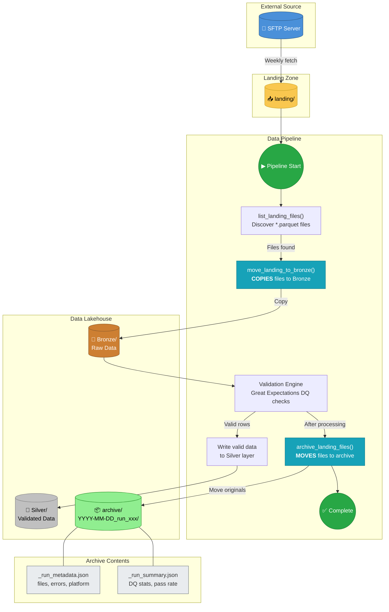

# AIMS Data Pipeline Flow

This diagram shows the complete data flow from SFTP ingestion through to archive.

## Key Points

| Step | Action | Method |
|------|--------|--------|
| 1 | SFTP drops files | External process |
| 2 | Discover files | `list_landing_files()` |
| 3 | **COPY** to Bronze | `move_landing_to_bronze()` |
| 4 | Validate data | Great Expectations |
| 5 | Write to Silver | Spark DataFrame |
| 6 | **MOVE** to archive | `archive_landing_files()` |
| 7 | Landing cleared | Ready for next fetch |

> **Important**: Files are **copied** to Bronze first, then **moved** to archive. This ensures Bronze always has data for processing while originals are preserved in dated archive folders.
