# AIMS Data Platform - Interactive Documentation Webapp

> **Version:** 1.0.0 | **Updated:** 26 January 2026

## Overview

A single-page interactive documentation webapp for the AIMS Data Platform, featuring:
- 📊 Interactive Mermaid.js diagrams with tabbed navigation
- 📈 Live pipeline metrics and status
- 🔧 Quick start guides for Local and MS Fabric environments
- 💾 Interactive Medallion Architecture visualization
- 🔗 Ecosystem integration with DQ Framework documentation

## Running Locally

### Using Python HTTP Server
```bash
cd /home/sanmi/Documents/HS2/HS2_PROJECTS_2025/1_AIMS_LOCAL_2026/webapp
python -m http.server 8889
```

Then open: http://localhost:8889

### Using Node.js (if available)
```bash
npx serve -p 8889
```

## Files

| File | Description |
|------|-------------|
| `index.html` | Main HTML document with all content |
| `styles.css` | CSS styling with design tokens |
| `app.js` | JavaScript for interactivity |
| `workflow_diagram.png` | Static fallback diagram |

## Features

### 1. Interactive Diagrams (Mermaid.js)

Four tabbed diagrams showing:
- **Pipeline Flow** - SFTP → Landing → Bronze → DQ → Silver → Gold → Archive
- **Platform Detection** - Local vs MS Fabric decision tree
- **DQ Validation** - Great Expectations validation flow
- **System Architecture** - Libraries and medallion layers

### 2. Mermaid.js Configuration

The webapp uses official Mermaid.js best practices:

```javascript
mermaid.initialize({
    startOnLoad: false,        // Manual rendering for tab handling
    theme: 'default',          // Matches Mermaid Playground
    securityLevel: 'loose',
    flowchart: {
        curve: 'basis',
        useMaxWidth: false     // CRITICAL: Prevents text cutoff
    }
});
```

**Key learnings from official docs:**
- Use `window.onload` instead of `DOMContentLoaded` to wait for fonts (prevents "labels out of bounds")
- Set `useMaxWidth: false` for proper natural sizing
- Hidden tabs must be temporarily shown for Mermaid to calculate dimensions

### 3. Tab Rendering Strategy

To render Mermaid diagrams in hidden tabs:

```javascript
window.addEventListener('load', async function () {
    // 1. Temporarily show all panels (hidden with visibility)
    panels.forEach(panel => {
        panel.style.visibility = 'hidden';
        panel.style.display = 'block';
        panel.style.position = 'absolute';
        panel.style.left = '-9999px';
    });

    // 2. Render all diagrams
    await mermaid.run();

    // 3. Restore tabbed state
    panels.forEach(panel => {
        panel.style.visibility = '';
        panel.style.position = '';
        panel.style.left = '';
        if (!panel.classList.contains('active')) {
            panel.style.display = 'none';
        }
    });
});
```

### 4. CSS for Mermaid Diagrams

```css
.mermaid-container {
    overflow-x: auto;
    overflow-y: visible;    /* Prevent text clipping */
}

.mermaid-container svg {
    max-width: 100%;
    height: auto;
    overflow: visible;      /* Ensure text not clipped */
}

pre.mermaid {
    font-family: 'trebuchet ms', verdana, arial, sans-serif;
}
```

### 5. Expand/Fullscreen Diagrams

Each diagram has an expand button for fullscreen viewing:

```javascript
function expandDiagram(containerId) {
    const container = document.getElementById(containerId);
    container.classList.toggle('expanded');
}
```

## Diagram Syntax (Mermaid)

### Basic Flowchart


### With Subgraphs and Styling

```mermaid
flowchart LR
    subgraph Group["📊 Group Name"]
        A[Node A]
        B[Node B]
    end
    
    A --> B
    
    style Group fill:#e1f5fe,stroke:#01579b
```


### Database/Cylinder Nodes


### Decision Diamonds


## Troubleshooting

### Text Cut Off
- Ensure `useMaxWidth: false` in flowchart config
- Use `window.onload` not `DOMContentLoaded`
- Check CSS `overflow: visible` on SVG elements

### Diagrams Not Rendering in Hidden Tabs
- Must temporarily show tabs during `mermaid.run()`
- Use `visibility: hidden` instead of `display: none` during render

### Theme Not Matching Playground
- Use `theme: 'default'` globally
- Don't override with `%%{init:...}%%` unless necessary

## References

- [Mermaid.js Official Docs](https://mermaid.js.org/)
- [Mermaid Live Editor](https://mermaid.live/)
- [Theme Configuration](https://mermaid.js.org/config/theming.html)
- [Usage Guide](https://mermaid.js.org/config/usage.html)
